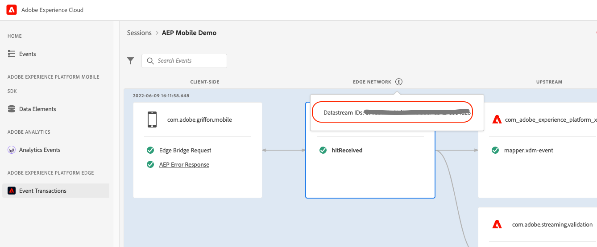

# Enable validation workflows for Edge with Adobe Experience Platform Assurance

Assurance is a new, innovative product from Adobe to help you inspect, proof, simulate, and validate data collection and experiences for your mobile application.

## Getting started with Assurance

If this is the first time you use the Assurance extension, [follow the installation instructions](https://aep-sdks.gitbook.io/docs/foundation-extensions/adobe-experience-platform-assurance) and include the library to your mobile application, then continue with the steps below.

## Assurance views

Assurance provides a variety of views to help you efficiently debug and introspect a certain workflow. This document covers the views relevant for validating Edge implementations. For other examples, see also [Use Project Griffon](https://aep-sdks.gitbook.io/docs/beta/project-griffon/using-project-griffon).

### Event transactions

#### Overview

With the Event transactions view you can now validate your AEP Edge Network mobile implementation and debug in near real time with your client-side events as well as with the upstream configuration and XDM validation.

#### Using Event Transactions view

To get started, complete the following steps:

1. Ensure that you implemented the latest versions of the Assurance and Edge Network extensions.
2. Go to https://experience.adobe.com/griffon.
3. Connect your app to an Assurance session. For more information, see [Connect your device](https://aep-sdks.gitbook.io/docs/beta/project-griffon/using-project-griffon).
4. To view the events, select the **Event Transactions** view. If you do not see this option, select **Configure** from the bottom left of the window, add the Event Transactions view and select **Save**.

##### Get familiar with the Event Transactions view elements

At a high-level the Event Transactions view displays 3 columns:
- CLIENT-SIDE - this column represents the client-side events that were collected either based on an API call such as sendEvent, or the response handle received by the client from the Edge Network server. Examples:
    - AEP Request Event - represents the experience event sent through the AEP Edge extension and contains the XDM and free-form data.
    - AEP Response Event Handle: represents the event handle received from Experience Edge in response to an AEP Request Event.
    - AEP Error Response: you may see this error event in case of an error with the XDM payload sent to Experience Edge or if a server-side error is returned for other reasons.
- EDGE NETWORK - This column indicates the event received server-side by the Edge Network.
- UPSTREAM - This column displays the events received by the configured upstream services and/or processing or validation status for the incoming event. This column is dynamic and may display different types of events depending on your datastream configuration and the services enabled.

You can verify the currently used datastream identifier by selecting the info tooltip next to the EDGE NETWORK column header.

